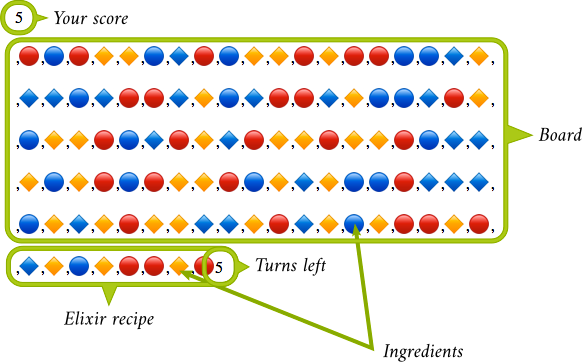

<div align="center" style="margin:60px 0">
    <p></p>
</div>

## How to play

Remove an ingredient from the board to start a **chain explosion**. Chained ingredients clear the **elixir recipe** on the bottom. Prepare potions to earn **points and turns**. Go for the best score!

<div align="center" style="margin:60px 0">
    <p></p>
</div>

Play the game [here](https://kesiev.com/elixirexplosive).

*"Elixir Explosive" is a tiny tribute to the brilliant and super fun board game [Potion Explosion](https://www.horrible-games.com/bg-potionexplosion/) designed by Stefano Castelli, Andrea Crespi and Lorenzo Silva and pictured by Giulia Ghigini.*

## Why?

Board games are to videogames as plays are to movies. In plays and board games, authors have to come up with paper, wood, plastic, and words to enact wars, debates and love stories, unlike movies and videogames in which technology helped on *showing and don't tell* facts.

The theatre and board games are still limited by the *physical world* so *how* to tell a story is a recurring problem that's painful to solve in a different every time - but, in my humble opinion, that's also the most stimulating part of them.

Discovering board games as a gamer is like living a neverending early age of videogames, in which game designers were tasked on mining *fun* from cold computers. Genres are still a vague thing and every game is a blend of mechanics coming from thousands of years ago or never seen before that dares to take inspiration from history, literature, pop culture and even from movies and videogames itself.

*Potion Explosion* (2015) is probably not the deepest of them nor the most famous or played one. But it surprised me on how broad its influences are: it's a board game inspired by match-3 videogames, a subgenre of the seminal [tile matching](https://en.wikipedia.org/wiki/Tile-matching_video_game) genre that's living a second life in this mobile gaming age, that feels like the [Nim](https://it.wikipedia.org/wiki/Nim), another board game lost in time.

The result is surprisingly fun to play and, in some ways, it feels like something a bunch of *old men disconnected from the network* could play in a *cyberpunk future*. That's why I tried to *code golf* the basic game mechanics and fit the source code in a *potion-shaped sticker*. You can type-in the code in an HTML file and play the game in your browser.

```
              <p id=d
             ><script>(
             q=s=>{for(
             c=g[v=20],
              g=c?g:n=
              ``,i=101
           ;i--;g=c?(g[s]*
            a?(a--,w=[...
              g],w[s]=3
              ,s=w.join
              ``):g)[r=
             `replace`](
            /([^3])3(.)/,
          (e,f,g)=>f+(f-g?g
        :9+g))[r](eval(`/${j=
      i%8}+9${j}+/`),e=>[...e].
     map(l=>t=t[r](l,n))|j&&3):g
     +(i%v&&b))b=4*Math.random(m
     =i<8?m+b:n)|4;t||(p+=a+=5,t
     =m);d.innerHTML=p+[...g+t].
      map((e,g)=>-e?`<a onclick
         =q(${g})>&#x1F53${e
          }</a>`:`<p>`)+a})
             (g=t=p=a=0)
              </script>
```

When JavaScript coding language will be ancient and mysterious enough, we already have our *old gamers club logo*. Or you can use it to print one of that nice *cryptic cross-culture t-shirts*.

## Thanks

Thanks to:

  * Stefano Castelli, Andrea Crespi and Lorenzo Silva for designing such a fine game
  * [Sgananzium](http://www.sgananzium.it/) for suggesting the game in [last year video](https://youtu.be/vqIXbLi3rsY?t=247) and his great reviews in general
  * [Horrible Games](http://horrible-games.com/) for publishing some of the nicest board games I'm playing with...
  * [Bianca](http://www.linearkey.net/) for playing and discussing about videogames and board games in these 10+ years together
